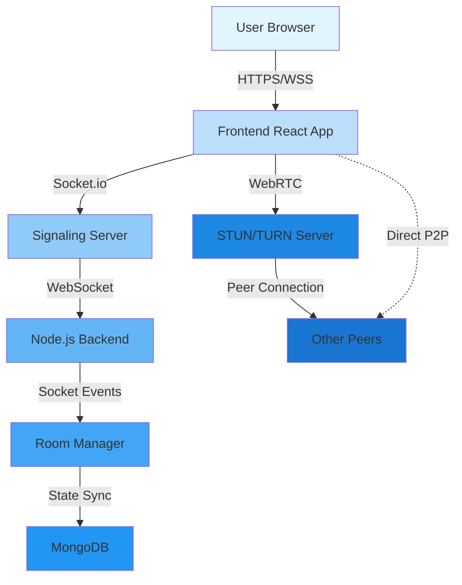

<div align="center">

# 🚀 ConvoX Meet

### *Next-Gen Real-Time Video Conferencing Platform*

[](https://convox-meetfrontend.onrender.com/)
[](https://github.com/devanshrawat27/Convox-Meet)


*Built with passion by developers, for seamless communication* 💬

[Features](#-features) • [Demo](#-demo) • [Tech Stack](#-tech-stack) • [Installation](#-installation) • [Architecture](#-architecture)

---

</div>

## 🌟 About The Project

**ConvoX Meet** is a cutting-edge, full-stack video conferencing solution that brings people together through crystal-clear communication. Built on the powerful MERN stack and leveraging WebRTC technology, it delivers enterprise-grade features with a sleek, intuitive interface.

### 🎯 Why ConvoX Meet?

- **⚡ Lightning Fast** - Peer-to-peer connections for minimal latency
- **🔒 Secure** - End-to-end encrypted communication
- **📱 Responsive** - Works flawlessly on any device
- **🎨 Modern UI** - Beautiful interface built with Tailwind CSS
- **🌐 Scalable** - Handle multiple concurrent rooms effortlessly

---

## ✨ Features

<div align="center">

| Feature | Description |
|---------|-------------|
| 🎥 **HD Video Calling** | Crystal-clear video communication with adaptive bitrate |
| 🎤 **Audio Controls** | One-click mute/unmute with visual indicators |
| 👥 **Multi-User Support** | Host unlimited participants in a single room |
| 💬 **Live Chat** | Real-time messaging alongside video calls |
| 🖥️ **Screen Sharing** | Share your screen with all participants |
| 🔐 **Secure Rooms** | Unique room IDs for private meetings |
| 📊 **Connection Status** | Real-time network quality indicators |
| 🎨 **Responsive Design** | Seamless experience across all devices |

</div>

---

## 🎥 Demo

<div align="center">

### Application Showcase

<table>
  <tr>
    <td width="50%">
      
      <p align="center"><b>🏠 Home Screen</b></p>
    </td>
    <td width="50%">
      
      <p align="center"><b>📹 Video Call Interface</b></p>
    </td>
  </tr>
  <tr>
    <td width="50%">
      
      <p align="center"><b>👥 Multi-User Conference</b></p>
    </td>
    <td width="50%">
      
      <p align="center"><b>💬 Live Chat System</b></p>
    </td>
  </tr>
</table>

### 🌐 [Try Live Demo](https://convox-meetfrontend.onrender.com/)

</div>

---

## 🏗️ Architecture



### 🔄 Communication Flow

1. **🔌 Connection** - User connects to frontend app
2. **🆔 Room Creation** - Unique room ID generated via Socket.io
3. **📡 Signaling** - WebSocket-based signaling for peer discovery
4. **🤝 WebRTC Handshake** - SDP offer/answer exchange
5. **🎯 ICE Negotiation** - NAT traversal using STUN servers
6. **🚀 P2P Connection** - Direct media stream between peers
7. **💬 Chat Sync** - Real-time message broadcasting

---

## 💻 Tech Stack

### 🎨 Frontend Technologies

```javascript
{
  "framework": "React.js 18+",
  "styling": "Tailwind CSS",
  "communication": "Socket.io Client",
  "webrtc": "Native WebRTC APIs",
  "stateManagement": "React Hooks (useState, useEffect, useRef)",
  "routing": "React Router v6",
  "language": "JavaScript ES6+"
}
```

**Key Frontend Responsibilities:**
- 🎬 Dynamic video grid rendering
- 🎛️ Media device management (camera/mic)
- 🖼️ Screen sharing implementation
- 💬 Real-time chat UI
- 📱 Responsive layout system

### ⚙️ Backend Technologies

```javascript
{
  "runtime": "Node.js 16+",
  "framework": "Express.js",
  "websocket": "Socket.io",
  "database": "MongoDB + Mongoose",
  "authentication": "JWT (Optional)",
  "cors": "CORS middleware"
}
```

**Key Backend Responsibilities:**
- 📡 WebSocket signaling server
- 🏠 Room lifecycle management
- 👤 Participant tracking
- 🔄 Event broadcasting & synchronization
- 📊 Connection state management

---

## 🚀 Installation

### 📋 Prerequisites

- Node.js >= 16.x
- npm or yarn
- MongoDB instance (local or Atlas)
- Modern web browser with WebRTC support

### 📥 Clone Repository

```bash
git clone https://github.com/devanshrawat27/Convox-Meet.git
cd ConvoX-Meet
```

### 🔧 Backend Setup

```bash
# Navigate to backend directory
cd backend

# Install dependencies
npm install

# Create environment file
touch .env
```

**Configure `.env` file:**

```env
PORT=5000
MONGO_URI=your_mongodb_connection_string
NODE_ENV=development
CORS_ORIGIN=http://localhost:3000
```

**Start backend server:**

```bash
# Development mode with hot reload
npm run dev

# Production mode
npm start
```

Backend will run on `http://localhost:5000` 🟢

### 🎨 Frontend Setup

```bash
# Navigate to frontend directory (from root)
cd frontend

# Install dependencies
npm install

# Start development server
npm start
```

Frontend will run on `http://localhost:3000` 🟢

### 🐳 Docker Setup (Optional)

```bash
# Build and run with Docker Compose
docker-compose up --build

# Run in detached mode
docker-compose up -d
```

---

## 🧪 Testing

```bash
# Run frontend tests
cd frontend
npm test

# Run backend tests
cd backend
npm test

# Run end-to-end tests
npm run test:e2e
```

---

## 📚 API Documentation

### Socket Events

#### 📤 Client → Server

| Event | Payload | Description |
|-------|---------|-------------|
| `join-room` | `{ roomId, userId }` | Join a meeting room |
| `offer` | `{ offer, to }` | Send WebRTC offer |
| `answer` | `{ answer, to }` | Send WebRTC answer |
| `ice-candidate` | `{ candidate, to }` | Exchange ICE candidate |
| `leave-room` | `{ roomId, userId }` | Leave meeting |
| `chat-message` | `{ roomId, message }` | Send chat message |

#### 📥 Server → Client

| Event | Payload | Description |
|-------|---------|-------------|
| `user-joined` | `{ userId }` | New user joined |
| `user-left` | `{ userId }` | User disconnected |
| `offer` | `{ offer, from }` | Receive WebRTC offer |
| `answer` | `{ answer, from }` | Receive WebRTC answer |
| `ice-candidate` | `{ candidate, from }` | Receive ICE candidate |
| `chat-message` | `{ message, from }` | Receive chat message |

---

## 🔐 Security Features

- ✅ Encrypted peer-to-peer connections
- ✅ Unique room ID generation
- ✅ CORS protection
- ✅ Input sanitization
- ✅ Rate limiting on signaling server
- ✅ Secure WebSocket connections (WSS)

---

## 🤝 Contributing

Contributions make the open-source community an amazing place! Any contributions are **greatly appreciated**.

1. Fork the Project
2. Create your Feature Branch (`git checkout -b feature/AmazingFeature`)
3. Commit your Changes (`git commit -m 'Add some AmazingFeature'`)
4. Push to the Branch (`git push origin feature/AmazingFeature`)
5. Open a Pull Request

---

## 📝 License

Distributed under the MIT License. See `LICENSE` for more information.

---

## 👨‍💻 Developer

<div align="center">

### **Devansh Rawat**

*Software Engineering Student | Full-Stack Developer*

[](https://github.com/devanshrawat27)
[](#)
[](#)

</div>

---

## 💖 Support

If you found this project helpful, please consider:

- ⭐ Starring the repository
- 🐛 Reporting bugs
- 💡 Suggesting new features
- 📢 Sharing with others

---

<div align="center">

### 🌟 Star History

[](https://star-history.com/#devanshrawat27/Convox-Meet&Date)

---

**Made with ❤️ by [Devansh Rawat](https://github.com/devanshrawat27)**


</div>
